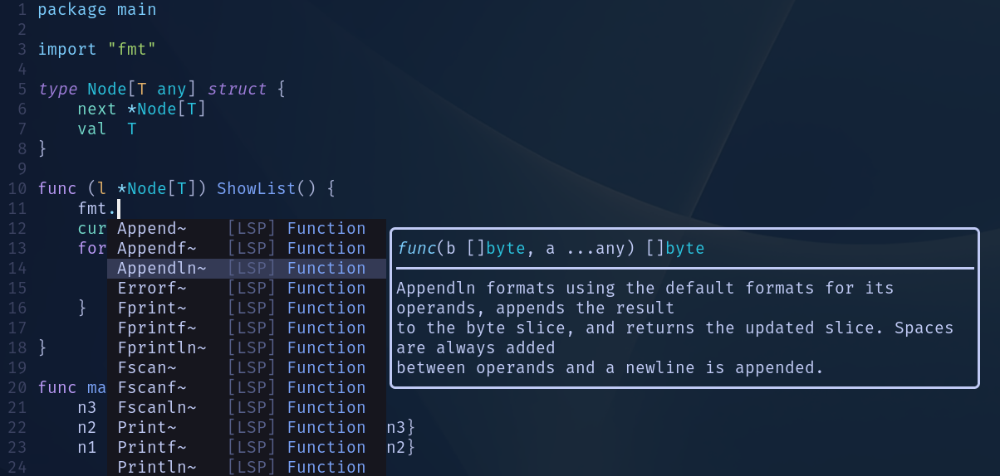

# gear-up.nvim



Tiny configuration to get started with Neovim.

Goals:
- Tiny (less than 100 lines)
- Single-file
- Language server support (+completions)

This configuration targets neovim release 0.8+ and the nightly.

This repo is meant to be used as a starting point for a user's own configuration; remove the things you don't use and add what you miss.

## Installation

- Backup your previous configuration
- Copy and paste the file `init.lua` into `$HOME/.config/nvim/init.lua`
- Run the following command in your shell:

```
nvim --headless -c 'autocmd User PackerComplete quitall' -c 'PackerSync'
```

- start neovim

## See also

- [kickstart.nvim](https://github.com/nvim-lua/kickstart.nvim)
- [rstacruz/nvim-starter](https://github.com/rstacruz/nvim-starter)
- [VonHeikemen/nvim-starter](https://github.com/VonHeikemen/nvim-starter)
